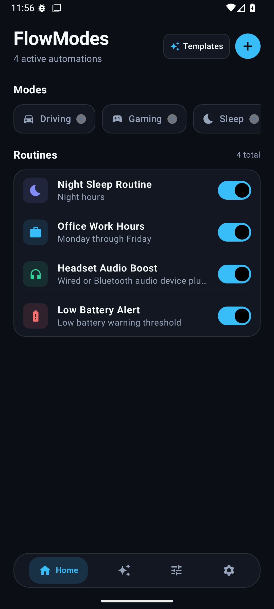

# 🌊 FlowModes — Smart Focus Modes & Automation for Android

<p align="center">
  
  
  
  
  
</p>

<p align="center">
  <strong>Transform your Android device into an intelligent, contextual companion.</strong><br>
  FlowModes delivers iOS Focus Modes meets Tasker power—wrapped in a fluid, ultra-responsive Material 3 Expressive UI.
</p>

---

## 🌟 Highlights & Capabilities

- 🎯 **Contextual Focus Modes** — Switch effortlessly between Focus, Deep Work, Driving, Sleep, Fitness, and custom modes.
- ⚡ **Trigger-Condition-Action Automation Engine** — Chain Wi-Fi SSIDs, Bluetooth devices, Battery thresholds, Geo-Fencing, App Launches, and Time Schedules.
- 🎨 **Material 3 Expressive Glass UI** — Custom fluid slider controls, organic glow accents, dark/light theme synergy, and 60/120fps stutter-free rendering.
- 📦 **One-Tap Routine Templates** — Instant gallery for Work Focus, Bedtime Silence, Commute Navigator, Battery Saver Extreme, and Gamer Mode.
- 📊 **Real-Time Execution Logs** — Complete history and visual debug telemetry showing triggered states, condition matches, and executed actions.
- 🔒 **Privacy-First & Fully On-Device** — Zero telemetry trackers, no account required, all trigger matching runs securely on your hardware.

---

## 📱 Screenshots & Visual Preview

| Home & Quick Toggle | Focus Mode Detail | Visual Routine Builder |
|:---:|:---:|:---:|
|  |  |  |

| Automation Gallery | Live Execution Logs | Notification Center |
|:---:|:---:|:---:|
|  |  |  |

---

## 🛠️ Triggers & Actions Architecture

### 🎛️ Supported Triggers
- **Time & Days**: Exact time, recurring intervals, sunrise/sunset, weekday/weekend schedules.
- **Connectivity**: Specific Wi-Fi SSID connected/disconnected, Bluetooth device (Headphones, Car stereo, Smartwatch).
- **Power & Battery**: Battery falls below/rises above percentage, Charger plugged/unplugged (Fast/Wireless charging).
- **Application**: Foreground app detection (launching YouTube, Notion, Games, etc.).
- **Location**: Geofence entry and exit coordinates.
- **Headphone & Audio**: Wired jack or Bluetooth audio device plugged in.

### ⚙️ Supported Actions
- **Audio & Sound**: Set Media, Ringer, Alarm volume levels; switch to Silent, Vibrate, or Normal.
- **System Settings**: Toggle Do Not Disturb (DND), Bluetooth, Wi-Fi, Flashlight, Auto-rotate.
- **Display**: Set exact screen brightness, toggle Dark Mode, screen timeout.
- **App & Shortcut**: Launch target application, trigger navigation or music playback.
- **Haptics & Alerts**: Custom vibrations, spoken text-to-speech audio alerts, heads-up notifications.

---

## 🏗️ Architecture & Tech Stack

```
com.example/
├── automation/          # Background Automation Core
│   ├── engine/          # Condition evaluator, trigger matchers, action dispatchers
│   ├── receivers/       # BroadcastReceivers for Battery, Wi-Fi, Bluetooth, Screen
│   ├── scheduler/       # AlarmManager & WorkManager background schedulers
│   └── services/        # Foreground service for persistent state listening
├── data/                # Data Access Layer
│   ├── repository/      # Routines, Modes, Logs, and App repositories
│   └── model/           # Room / In-memory data entities & DTOs
├── domain/              # Clean Architecture Use Cases & Business Rules
├── permissions/         # Android 14+ granular permission helpers (DND, Insets, etc.)
├── ui/                  # 100% Jetpack Compose UI
│   ├── components/      # Glassmorphic cards, FlowSwitch, FlowSlider, FlowRowItem
│   ├── screens/         # Home, Modes, Routines, Builder, Templates, Logs, Settings
│   └── theme/           # Dynamic Material 3 Expressive theme palette & typography
└── util/                # Performance utilities, icon decoders, date helpers
```

- **UI Framework:** Jetpack Compose + Material 3 (M3)
- **Language:** Kotlin 2.0+ with Coroutines & StateFlow
- **Background Tasks:** Android WorkManager + AlarmManager + BroadcastReceivers
- **Performance Optimized:** 0-allocation list items, async icon pre-caching, strict Compose `key` & `contentType` stability.

---

## 🚀 Getting Started

### Prerequisites
- Android Studio Ladybug (2024.2.1+) or newer
- JDK 17 or higher
- Android SDK 35 (Android 15) / Minimum SDK 26 (Android 8.0)

### Quick Build
```bash
# Clone the repository
git clone https://github.com/your-username/FlowModes.git
cd FlowModes

# Build the debug APK
gradle :app:assembleDebug

# Run unit and local logic tests
gradle :app:testDebugUnitTest
```

---

## 💡 What Makes FlowModes Unique?

1. **Zero Battery Drain Design**: Unlike polling-based automation tools, FlowModes leverages event-driven native Android broadcast listeners and alarm timers.
2. **Modern Fluid UI**: Say goodbye to clunky 2012-era automation interfaces. FlowModes was crafted ground-up with modern typography, smooth haptic micro-interactions, and dark mode excellence.
3. **True Transparency**: Every single trigger match and action execution is logged locally with millisecond timestamps and diagnostics.

---

## 🤝 Contributing

Contributions, feature requests, and bug reports are warmly welcome!
1. Fork the Project
2. Create your Feature Branch (`git checkout -b feature/AmazingFeature`)
3. Commit your Changes (`git commit -m 'Add some AmazingFeature'`)
4. Push to the Branch (`git push origin feature/AmazingFeature`)
5. Open a Pull Request

---

## 📄 License

Distributed under the **Apache 2.0 License**. See `LICENSE` for more information.

---

<p align="center">
  Crafted with care for the Android Community ❤️
</p>
